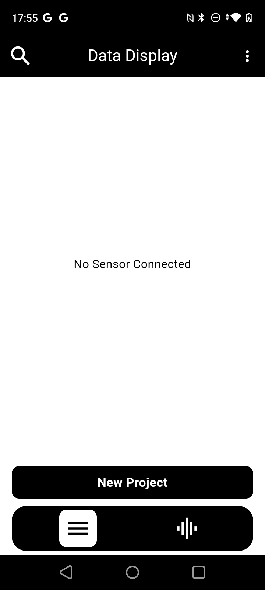
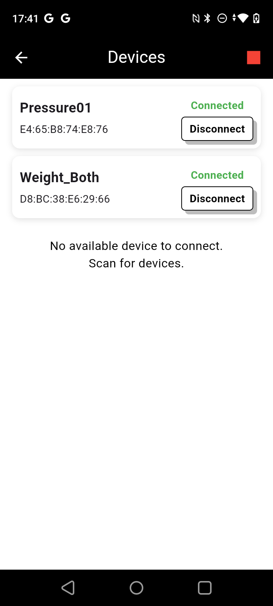
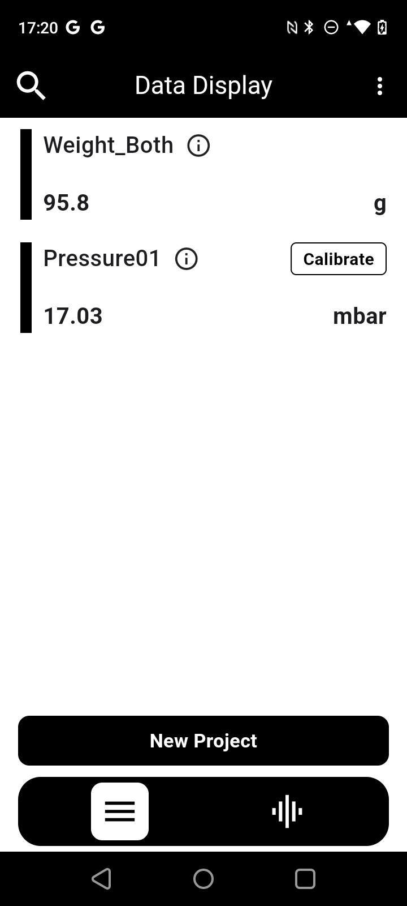
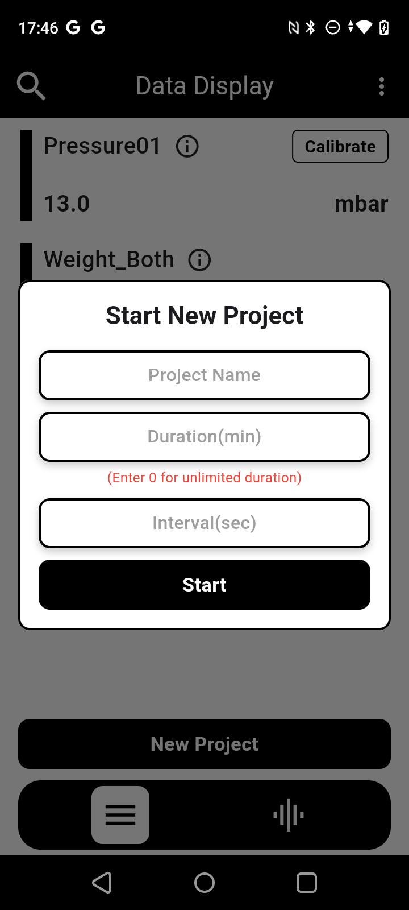

# Flapp

Proof-of-concept studies and lab scale setups are required which is a crucial path towards the emergence of new ideas and their transferability towards implementation. Such studies within research (academia or enterprise) are often limited by the availability of flexible, low-cost and portable devices that allow small configurations to be mounted, monitored and controlled.
The emergence of 3D printing, Arduino based environment and alternative source of supply pushed towards the Do-your-own (DYO) approach which is supported by online communities allowing for the development of cheap and interactive alternatives.

This work received the support of a fellowship from the “la Caixa” Foundation (ID 100010434). The fellowship code is LCF/BQ/PR21/11840009.

This Bluetooth Low Energy (BLE) App is responsible of gathering data values from different esp32-based sensor devices.
At the moment the app is designed for it to communicate with 6 types of water-sensing electronic sensors:
```
pH 
EC 
ORP 
Pressure 
Weight  (digital scales with RS232 or analog output)
Temperature
```
All this sensors can be connected at the same time and after finishing the experiment, be sent in .csv format to any e-mail address or saved in the internal mobile phone/tablet memory.

# App Usage Instructions
When the app is opened you see an empty screen where you can search new device by clicking in the magnifying glass icon.



When you click the magnifying glass all the Bluetooth available devices are shown. 
Select the device/s to pair and start seeing data in real time.



_maybe device will ask to pair with a new device. it is not necesary to pair with the device, the app will ask you to do it._

Once device is connected, see the data being received in Data Display:



User can Start a New Project to save the data for a period of time. Also user can adjust the interval in which the app will record the data values and also assign a project name:



When New Project's duration is over or button "Stop" is pressed, user will have the choice of sharing the data over e-mail or saving into the internal mobile memory

If Share is selected the app will bring up the default mail app and will compress the .csv file to be sent

Once data is shared user will be able to see a table-formated .csv file:
